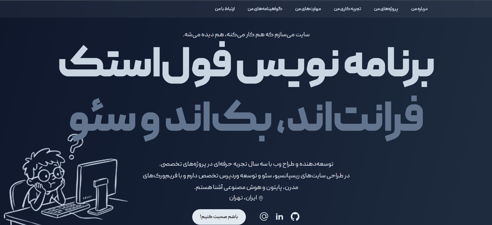

<div align="center">

# 💼 Mobin Nayebizadeh - Personal Portfolio

A modern, responsive, and performance-focused portfolio website built with **React**, **Vite**, and **Tailwind CSS** to showcase my projects, work experience, technical skills, and certifications.

### 🌐 Live Website
https://www.mobinnz.ir



</div>

---

# 📖 About

This project is my personal portfolio website designed to introduce myself, showcase my professional work, and present my experience as a Full Stack Web Developer.

The portfolio highlights:

- Personal introduction
- Featured projects
- Work experience
- Technical skills
- Certificates
- Contact information

The website is fully responsive and optimized for desktop, tablet, and mobile devices.

---

# ✨ Features

- 🎨 Modern UI Design
- 📱 Fully Responsive Layout
- ⚡ Fast Performance with Vite
- 🌙 Dark Theme
- 🧩 Component-Based Architecture
- 💼 Professional Project Showcase
- 📜 Work Experience Timeline
- 🏆 Certificates Section
- 📧 Contact Section
- 🚀 SEO Friendly Structure

---

# 🛠 Tech Stack

## Front-End

- React 19
- JavaScript (ES6+)
- Tailwind CSS 4
- HTML5
- CSS3

## Build Tool

- Vite

## Development Tools

- npm
- Git
- GitHub

---

# 📂 Project Structure

```
portfolio/
│
├── public/
│
├── src/
│   │
│   ├── assets/
│   ├── components/
│   │
│   ├── About/
│   ├── Certificate/
│   ├── Contact/
│   ├── Header/
│   ├── Hero/
│   ├── History/
│   ├── Project/
│   ├── Skills/
│   │
│   ├── App.jsx
│   ├── main.jsx
│   └── index.css
│
├── package.json
├── vite.config.js
└── README.md
```

---

# 🚀 Getting Started

Clone the repository

```bash
git clone https://github.com/MobinDevN/mobinnz-portfolio.git
```

Move into project directory

```bash
cd mobinnz-portfolio
```

Install dependencies

```bash
npm install
```

Run development server

```bash
npm run dev
```

Open

```
http://localhost:5173
```

---

# 📦 Production Build

Build the project

```bash
npm run build
```

Preview production build

```bash
npm run preview
```

---

# 📱 Responsive Design

The portfolio is optimized for:

- Desktop
- Laptop
- Tablet
- Mobile

---

# 📌 Website Sections

- Hero
- About Me
- Projects
- Work Experience
- Skills
- Certificates
- Contact

---

# 📸 Screenshots

## Home Page

> Add your screenshot below.


---

# 🌐 Live Demo

https://www.mobinnz.ir

---

# 👨‍💻 About Me

Hi 👋

I'm **Mobin Nayebizadeh**, a Full Stack Web Developer passionate about building modern, scalable, and user-friendly web applications.

I enjoy creating clean user interfaces, developing powerful backend systems, and continuously learning new technologies.

### Interested in

- React
- Django
- PHP
- Laravel
- Python
- WordPress
- SEO
- Artificial Intelligence

---

# 🤝 Connect With Me

🌐 Website

https://www.mobinnz.ir

💼 LinkedIn

https://www.linkedin.com/in/mobin-nayebizade-724b992b7

💻 GitHub

https://github.com/MobinDevN

📧 Email

your-email@example.com

---

# ⭐ Support

If you like this project, consider giving it a ⭐ on GitHub.

It helps the project become more visible and motivates me to build more open-source projects.

---

<div align="center">

Made with 💙 by Mobin Nayebizadeh

</div>